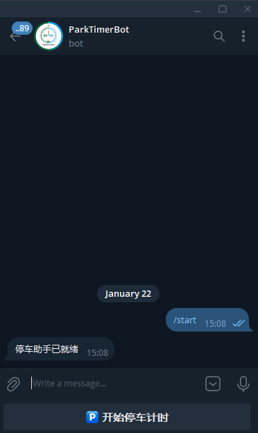
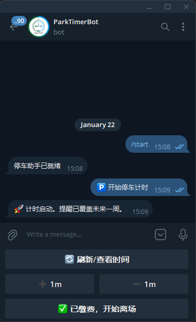
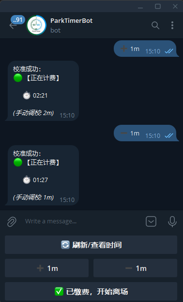
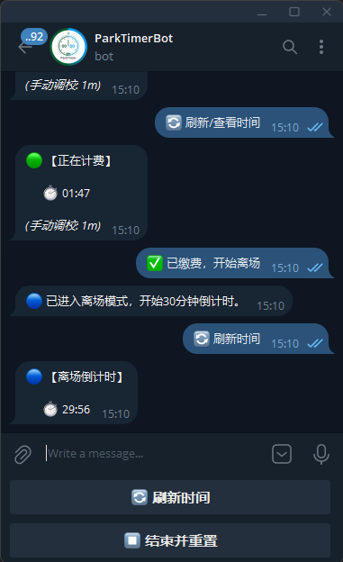

# ParkTimerBot

轻量的 Telegram 停车计时与提醒机器人。

快速开始

1. 复制示例配置：

```ini
#  config.ini
[DEFAULT]
TOKEN = your-telegram-bot-token-here
```

2. 创建虚拟环境并安装依赖：

```bash
python -m venv .venv
.venv\Scripts\activate
pip install -r requirements.txt
```

3. 运行机器人（当前布局：源文件位于 `src/` 根）：

```bash
copy config.example.ini config.ini
remind: 编辑 `config.ini` 填写 `TOKEN`（不要带引号）

python src\bot.py
```

注意事项：

- 请先将 `config.example.ini` 复制为 `config.ini` 并填写 `TOKEN`，不要将 `config.ini` 提交到远程仓库。
- `.gitignore` 中已包含 `config.ini` 和其他敏感/依赖文件。

创建 Telegram Bot（通过 BotFather）

1. 打开 Telegram 客户端，搜索并打开 `@BotFather`。
2. 发送 `/newbot` 并按照提示输入 bot 的显示名称（任意）与用户名（必须以 `bot` 结尾，例如 `MyParkBot` 或 `my_park_bot`）。
3. 创建完成后，BotFather 会返回一条消息，包含你的 Bot Token，形如：

```
123456789:AAEx...your_token_here
```

4. 将该 Token 填入项目根目录的 `config.ini`：

```ini
[DEFAULT]
TOKEN = 123456789:AAEx...your_token_here
```

注意事项：

- 不要把 `TOKEN` 用引号包围（`"` 或 `'`），否则程序会把引号当成 token 的一部分并导致认证失败。程序会自动剥离首尾空格。
- `config.ini` 含敏感信息，请勿提交到远程仓库；仓库中保留 `config.example.ini` 作为示例，`.gitignore` 已包含 `config.ini`。

额外 BotFather 常用命令：

- `/setprivacy`：设置是否允许 bot 在群组中接收所有消息（根据需要选择）。
- `/setdescription` 与 `/setabouttext`：设置机器人简介与关于文本。

故障排查

- 如果运行 `python src\bot.py` 没有输出，先确认 `config.ini` 中 `TOKEN` 已正确填写。可用下面命令在无缓冲模式下运行并查看错误堆栈：

```powershell
python -u -X faulthandler -c "import importlib, src; importlib.reload(src); src.main('config.ini')"
```

- 如果提示 `InvalidToken`：确认 token 正确且无额外引号或空白字符。
- 若提示配置文件读取编码错误，确保 `config.ini` 使用 UTF-8 编码保存。

运行与部署建议

- 开发时用虚拟环境并安装 `requirements.txt`。生产环境建议使用进程管理器（如 `systemd`、`pm2`、或 Docker 容器）托管并监控机器人进程。
- 若打算把包安装为命令行工具，可添加 `pyproject.toml`/`setup.cfg` 并定义 `console_scripts` 入口。

许可与贡献

- 许可证：MIT（见仓库根目录 `LICENSE`）。
- 欢迎提交 Issue 或 Pull Request。

说明

- 请勿将真实 `config.ini` 提交到仓库；仓库中保留 `config.example.ini` 作为示例。
- 若要打包或安装为可执行命令，可添加 `pyproject.toml` 或 `setup.cfg`。

许可证：MIT

示例截图

下面是几个示例截图（项目 `image/` 目录）：





